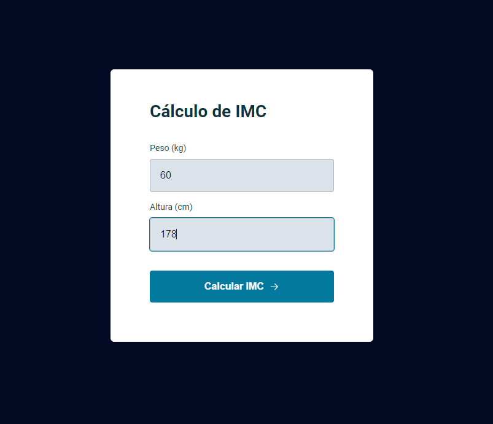

<h1 align="center">Projeto Calculadora de IMC</h1>

  <a href="#-preview">Preview</a>&nbsp;&nbsp;&nbsp;|&nbsp;&nbsp;&nbsp;
  <a href="#-tecnologias">Tecnologias</a>&nbsp;&nbsp;&nbsp;|&nbsp;&nbsp;&nbsp;
  <a href="#-projeto">Projeto</a>&nbsp;&nbsp;&nbsp;|&nbsp;&nbsp;&nbsp;
  <a href="#-layout">Layout</a>

 

## 🖥 Preview

## 🚀 Tecnologias

Esse projeto foi desenvolvido com as seguintes tecnologias:

- HTML
- CSS
- JavaScript
- Git e Github
- Figma

## 💻 Projeto

O projeto Calculadora de IMC, possui uma tela com visual intuitivo, com campos input para preenchimento de peso e altura, dados estes que são utilizados para o cálculo e posterior exibição em tela com o resultado de IMC do usuário.

Principais conceitos trabalhados:
- Estilização de formulário e telas
- Manipulação da DOM
- Criação e interação de modais (poup-ups)
- ES6 Modules: Import/Export
- Validação de dados
- Refatoração de código JavaScript

## 🔖 Layout

Você pode visualizar o layout do projeto através [DESSE LINK](https://www.figma.com/design/wTaKJj7sDK1KR71wolJxPk/IMC-(Copy)?m=auto&t=J5gNQPO7cwCscCDV-6), no Figma. 
designed by Rocketseat